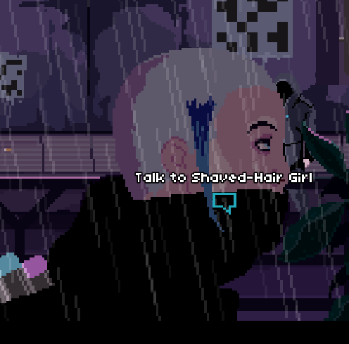
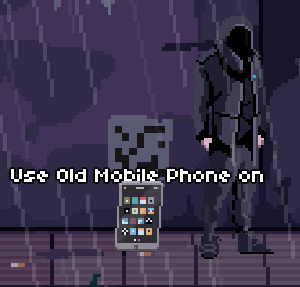

The writers seem to ignore you.

# Weird
Or are they? Have you used your headset?

# I have it on
Then you must see the that they are actually writing stuff to the wall.

# Cryptic stuff
Indeed. They only talk with the crypto-language that the gang members can read.

# Gang member?
[Get yourself the credentials for the gang,](020-join.md)

# I have them
Did you get the [starter kit](090-starter-kit.md)?

# I got it
Then he updated your AVR headset too. You can now talk to the writers.

# I did
They blocked you, right? They said that everyone in the streets is a writer nowadays.

# The streets?
Can you find one more writer from the streets?

# Hmm...
She is one of the passer-bys. Talk to the Shaved-Hair Girl as she passes by.

# About what?
"Are you a writer?", "Why are the QR codes on the wall", "I need information about a group of writers"

# What groups?
 - "The Blade"
 - "Onslaught"
 - "Uranium Crackers"
 - "Kid Crow"

# I don't have those
You have to scan the QR codes from the wall ^[Remove your headset] for all the four groups.

# With what?
Use the old mobile phone ^[You can buy it from the shop at Pill Street].

# I have asked about all four of those groups
Go talk to the writers in the Squat.

# They don't believe me!
[Proof that you are not a goddamn mag cop](100-proof.md)
