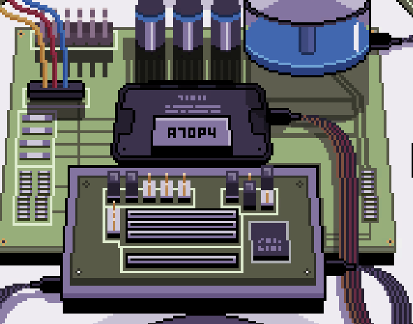
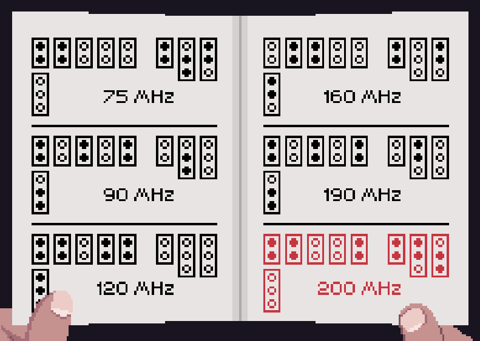
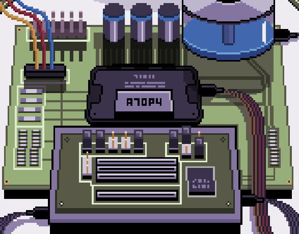

You have [the drone](050-drone.md) but it is too slow.

# How to make it faster?
Would the shop keeper back in the Pill Street help with the gadgets? Go talk to him to get the drone manual.

# I have the manual
Great, then you can clock the drone to run with 200Mhz.

# So, how?
Well, currently the drone jumpers look like this. It matches the manual's 75Mhz setting.

# Okay
So, you are going for the 200Mhz setting.

# Show me!
You have to use the extra jumper you get from your workbench at your home.

Click once on Jumper B, twice on Jumper A and once on Jumper 4.

