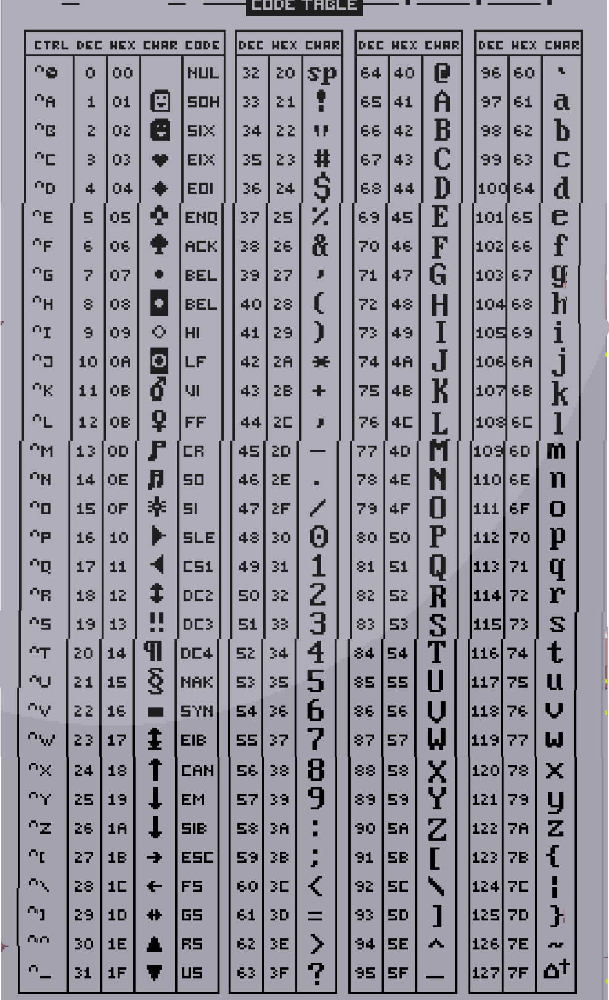

The shaman ^[Put on the AVR headset to see him] is giving you riddles.

# They are hard
Well, not that hard. They are quite simple addition and subtraction riddles. The outcome is a number always.

# What about the symbols?
Oh, those are ASCII codes. A number always matches one number.

# How do I know them?
You can get an ASCII code table ^[Talk to the sys admin at Nuwaka about her arts. She will print you a paper that has the ASCII codes].

# So...
Read closely the riddle (you can ask him to say it again) and add and subtract or otherwise know what he is talking about to get the correct number. You know if you chose correctly when the symbol travels _right_ instead of left. Follow the symbol.

Here is the ASCII table for reference:

# Show me some answers
Fine. This is not a definitive list. Please contribute your answers to help others.

| Riddle | Answer |
|:-------|--------|
| Mostly there's men, with women just two. In every corner the towers stand true. Dressed in white or dressed in black. Fighting each other atop in deck. | Chess pieces = 32 |
