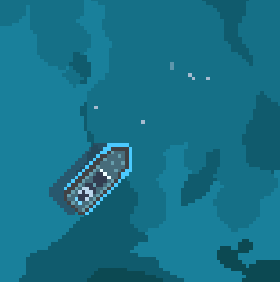

You are at the sea. Why wouldn't you fish?

# Fishing it is
There is a fishing net in the ship. Use it.

# Nada
You should find a perfect place to fish.

# Where?
On the map there are white lines in the sea. Those are fishes. The place changes constantly.

# Found it
Drive the ship over it and use the fishing net.
