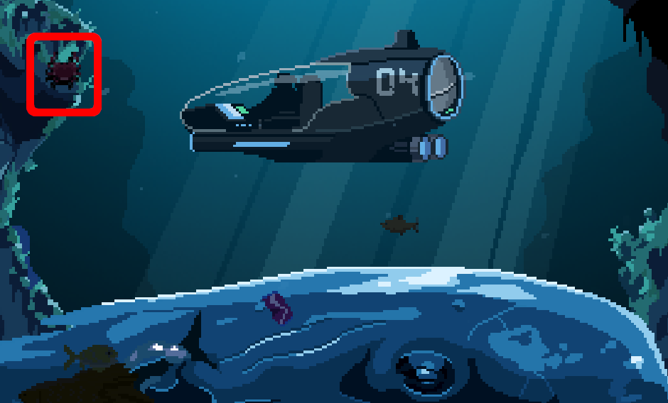

The sea is full of crabs.

# Haven't seen any
They live in the bottom. Did you find [the whale carcass](020-whale.md), already?

# Yes
That is perfect place for crabs. Dead fish to eat etc.

# Don't see any
It is there:

# Can't catch it!
You have to get it to stay.

# How?
Using a bait.

# Bait?
They really love fish eggs.

# Fish eggs?
First, [go fishing](060-fish.md).

# I have fish
Great, click the bunch of fish in your inventory to separate the one fish with eggs.

# I have it separated
Use a knife ^[ You find one from below the deck. Search the fisherman jacket. ] to get the eggs out.

# Fish eggs, yummy!
Those are for the crabs, rememeber? Put them in the cargo bay.

# They need a container
Put them first into a bottle ^[ You find a bottle below deck. ]. Put the bottle with eggs into the cargo bay.

# Ready!
Get back to the whale carcass and the crab.

# How to catch it?
Now, interact with the rocks above the crab. You will pour the fish eggs on the rocks. You can now grab the crab (I have always wanted to say that).

# Where's the crab?
Take it out of the cargo bay.
